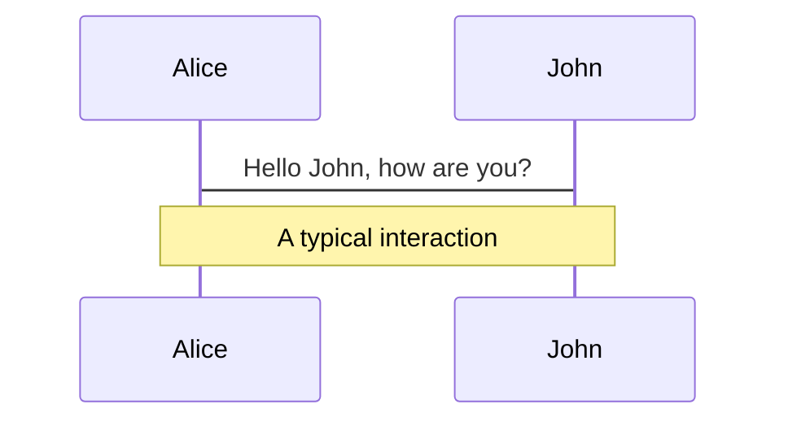
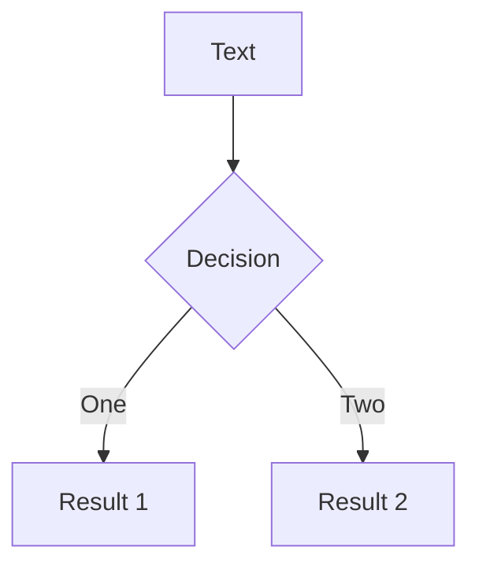
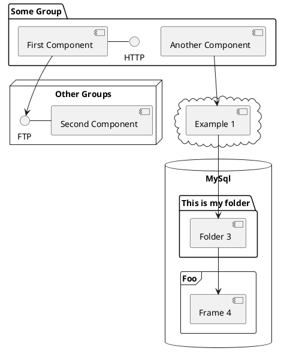

---
# try also 'default' to start simple
theme: seriph
# random image from a curated Unsplash collection by Anthony
# like them? see https://unsplash.com/collections/94734566/slidev
background: https://source.unsplash.com/collection/94734566/1920x1080
# apply any windi css classes to the current slide
class: 'text-center'
# https://sli.dev/custom/highlighters.html
highlighter: shiki
# show line numbers in code blocks
lineNumbers: false
# some information about the slides, markdown enabled
info: |
  ## Slidev Starter Template
  Presentation slides for developers.

  Learn more at [Sli.dev](https://sli.dev)
# persist drawings in exports and build
drawings:
  persist: false
# page transition
transition: slide-left
# use UnoCSS
css: unocss
---

# 简谈 laC：基础设施即代码

一起聊一聊 IaC 这些年的发展历史，以及 laC 的未来。

<!--
The last comment block of each slide will be treated as slide notes. It will be visible and editable in Presenter Mode along with the slide. [Read more in the docs](https://sli.dev/guide/syntax.html#notes)
-->

---
transition: fade-out
---

# 简谈 laC：基础设施即代码?

这次分享将分为几个部分进行

- 定义 IaC 的核心特征
- 了解一下 IaC 的过去
- 看看 IaC 的现在
- 吐槽一下 IaC

---
transition: fade-out
layout: image-right
image: https://user-images.githubusercontent.com/7054676/227723424-eee4bcbc-564c-4b1c-9b91-8a7222b7d365.png
---

# 自我介绍一下

可能大家已经熟悉我了，不过还是做以下自我介绍

- 曾经的 Manjusaka，现在的 Nadeshiko Manju
- 一个 SRE，一个 FreeLancer
- Python/Go/C/Lua 选手，Rust 学习中
- 一直在做基础设施相关的工作
- 捕蛇者说主播
- 微软 MVP
- [GitHub](https://github.com/Zheaoli) / [Twitter: Nadeshiko Manju](https://twitter.com/Manjusaka_Lee)
- 摇曳露营是世界上最好看的动漫，抚子赛高

---
transition: fade-out
---

# IaC 的几个核心特征

1. 最终的产物是 machine readable 的的产物。可能是一份代码，也可能是一份配制文件
2. 基于 machine readable 的产物，可以进一步依赖已有的 VCS 系统（SVN，Git）等做版本管理
3. 基于 machine readable 的产物，可以进一步依赖已有的 CI/CD 系统（Jenkins，Travis CI）等做持续集成/持续交付
4. 状态的一致性，或者称为幂等性。即理论上来讲，基于同样一份 Code，同一套参数构建出的产物，其最终的行为应该是一致的

---

# IaC 诞生的背景

在千禧年之后，互联网世界迭代的速度愈发的快速，这个时候传统的手工式的维护面临着几个问题

1. 交互式变更所引入的人的因素太大，导致了变更的不可控性
2. 人工变更面对愈发快速的 Infra 迭代力有不逮
3. 交互式的变更导致管控的难做，让版本控制之类的手段变为空谈

 

这意味着我们需要利用一种已知复杂度的手段来解决未知复杂度的问题

---
transition: fade-out
layout: image-right
image: https://user-images.githubusercontent.com/7054676/227724844-9f3dc775-611a-403f-a7d7-7b66fd67c79c.png
---

# 最古早的 IaC

其实右图能说明一些东西

1. 各种祖传代码的封装
2. 没有形成统一的标准

 

---
transition: fade-out
---

# 进一步迭代的 IaC

1. Ansible
2. Chef
3. Puppet

---
transition: fade-out
---

# 进一步迭代的 IaC

他们有一些共同的特点

1. 框架内部提供了常见的比如 SSH 链接管理，多机并行执行，auto retry 等功能
2. 基于上面描述的这一套基础功能，提供了一套 DSL 封装。让开发者更专注于 IaC 的逻辑，而非基础层面的细节
3. 其开源开放，并形成了一套完善的插件机制。社区可以基于这一套提供更丰富的生态。比如 SDN 社区基于 ANSIBLE 提供了各种交换机的 playbook 等

---

# Diagrams

You can create diagrams / graphs from textual descriptions, directly in your Markdown.

[Learn More](https://sli.dev/guide/syntax.html#diagrams)

---
src: ./pages/multiple-entries.md
hide: false
---

---
layout: center
class: text-center
---

# Learn More

[Documentations](https://sli.dev) · [GitHub](https://github.com/slidevjs/slidev) · [Showcases](https://sli.dev/showcases.html)
